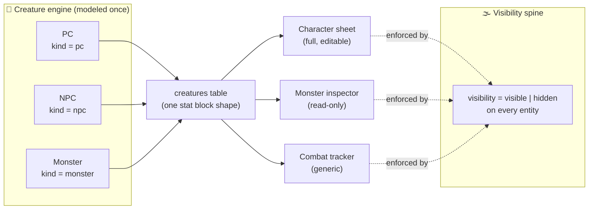
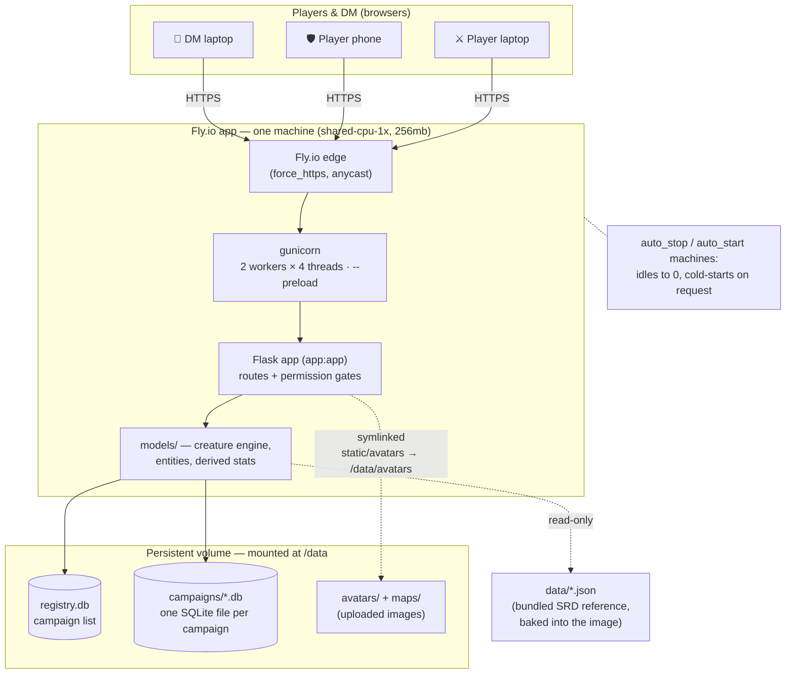
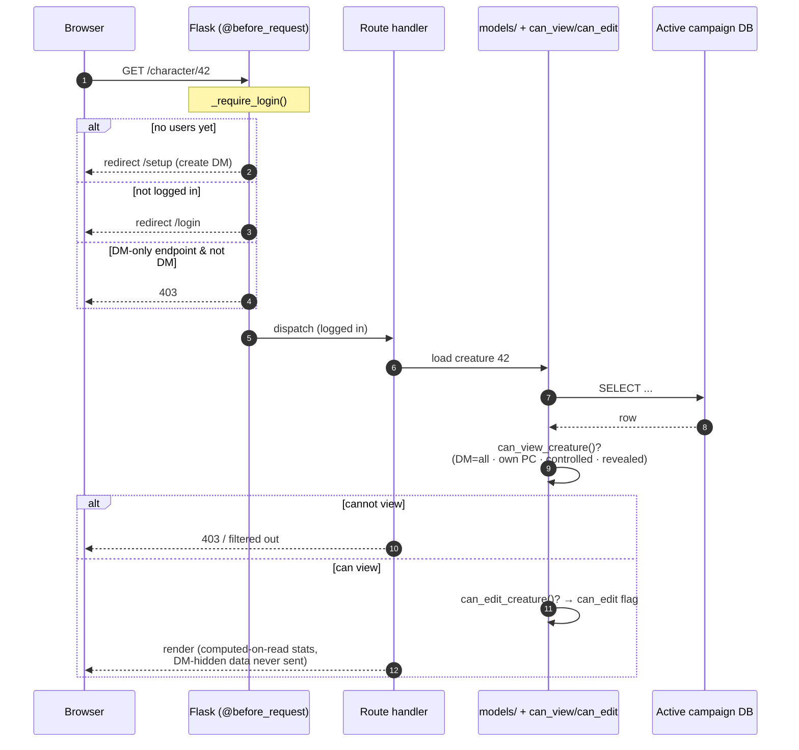
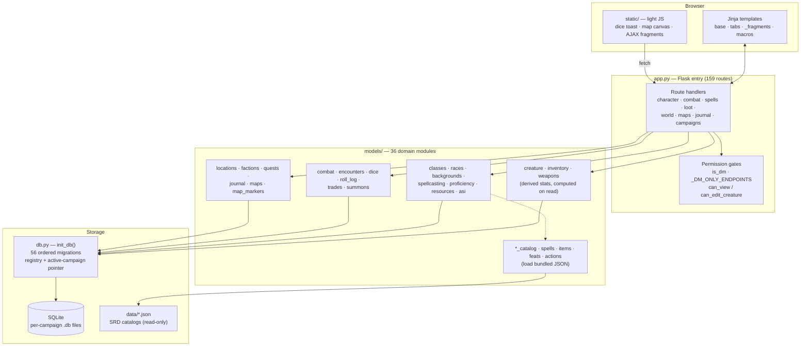
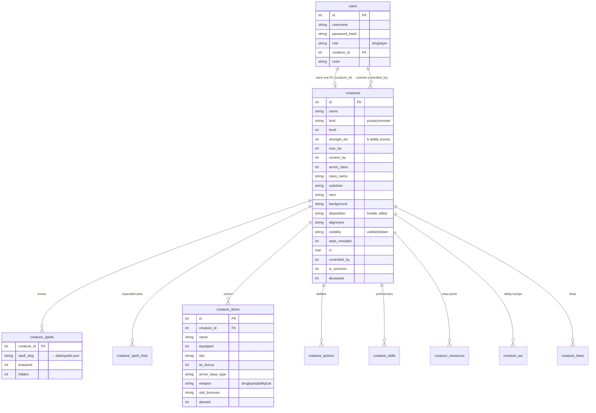
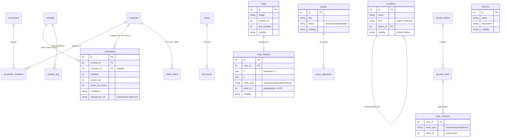
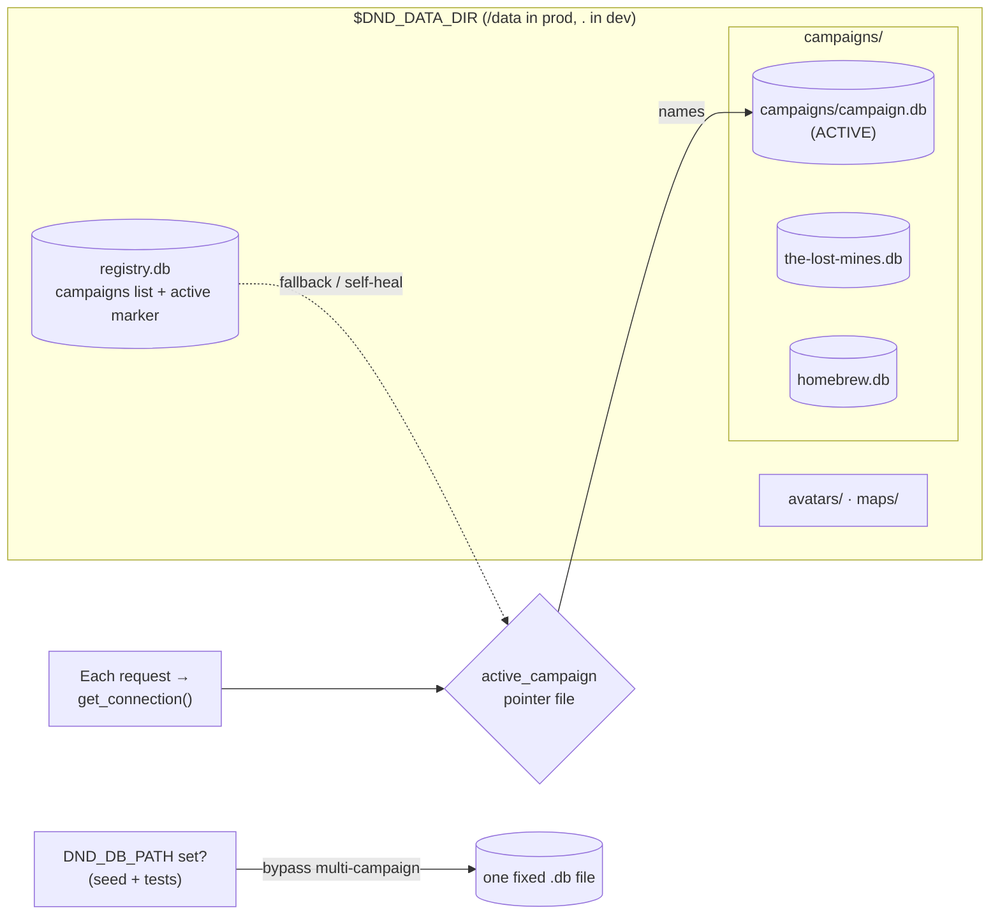

# 🐉 D&D Campaign Tracker

A multi-user web app for running a **Dungeons & Dragons 5e** campaign. The
**Dungeon Master** manages the entire world; **players** log in to track their
own characters and look up how their spells and abilities work inline — built for
a table that's new to D&D.

It's both a real tool and a tech-learning project: the first genuinely
**multi-user, authenticated, hosted** web app in its sibling workspace. Posture
is mostly **track** (record-keeping) with targeted **assist** features (dice
roller, combat math, rules lookup) where they earn their place.

> **Status:** built out and **deployed live on Fly.io**. ~3,700-line Flask app ·
> 159 routes · 36 model modules · a 56-migration SQLite schema · ~13k lines of
> bundled SRD reference data (spells, classes, races, monsters, items…).

```
Python + Flask · SQLite (stdlib) · server-rendered Jinja + light JS · no build step
Hosting: Fly.io · gunicorn in Docker · one machine + one persistent volume
Rules data: D&D 5e SRD 5.1 (CC-BY-4.0)
```

---

## Table of contents

- [What it does](#what-it-does)
- [The two architectural spines](#the-two-architectural-spines)
- [How the system is hosted (deployment)](#how-the-system-is-hosted-deployment)
- [How a request flows (permissions & fog of war)](#how-a-request-flows-permissions--fog-of-war)
- [Application internals](#application-internals)
- [The database (SQLite schema)](#the-database-sqlite-schema)
- [Multi-campaign storage layout](#multi-campaign-storage-layout)
- [Getting started](#getting-started)
  - [Option A — run it yourself (local)](#option-a--run-it-yourself-local)
  - [Option B — access the hosted web app](#option-b--access-the-hosted-web-app)
  - [Option C — deploy your own (Fly.io)](#option-c--deploy-your-own-flyio)
- [Tech decisions](#tech-decisions)
- [Attribution](#attribution)

---

## What it does

- **Character sheets** — the full editable creature view: ability scores, HP, AC,
  resistances, classes/subclasses, races, backgrounds, leveling, ASI/feats,
  proficiency + expertise, spellcasting, inventory + magic items, weapon attacks.
- **Spells & actions** with inline **5e SRD rules text**, so new players can read
  what a spell does — including clickable dice (`1d8` → roll it).
- **Dice roller** — full polyhedral set plus expressions like `2d6+3`, app-wide
  with a floating roll toast and a shared, per-player-colored log.
- **Monster inspector** — Baldur's Gate 3-style read-only stat reveal (HP, AC,
  resistances), DM-gated.
- **Combat tracker** — initiative, conditions, typed damage/healing, death saves,
  rests, and a combat log — operating on PCs and monsters generically.
- **World layer** — locations, factions, a campaign journal, a quest log, and a
  "known entities" sidebar that all point at the same underlying entities.
- **Maps** — uploaded backgrounds with overlay markers, sub-maps, an optional
  battle grid, and per-marker fog of war.
- **Companions & summons**, **PC-to-PC trading**, a **graveyard** for the fallen.
- **Public/private knowledge ("fog of war")** — the DM sees everything; players
  see only what they've discovered or the DM has revealed. Enforced server-side.
- **Multiple campaigns ("saves")** — each is its own SQLite file the DM toggles
  between.

---

## The two architectural spines

Everything hangs off two core ideas — get these right and features are mostly
views on top.

### 1. The creature / stat-block engine

A **PC, an NPC, and a monster are the same kind of thing**: a *creature* with a
stat block. Modeled **once**; a `kind` column (`pc` | `npc` | `monster`) is the
only thing that distinguishes them.

- A **character sheet** = the full, editable creature view.
- The **monster inspector** = a trimmed, read-only view.
- **Combat** operates on creatures generically — no special-casing.

### 2. The public/private visibility spine ("fog of war")

Every entity (creature, location, faction, map marker, quest, even individual
monster stats) carries a **visibility** state. The DM sees everything; players
see only what's been revealed. **Visibility is enforced server-side** — DM-hidden
data is never shipped to the client and hidden with CSS.



---

## How the system is hosted (deployment)

A stateful Flask + SQLite app with local file uploads, so it runs as **one
machine with one persistent volume** — running multiple machines would give each
its own divergent copy of the SQLite file. Production is served by **gunicorn**
inside a Docker image; `fly.toml` declares the machine + volume.



Key points the diagram encodes:

- **One machine, one volume.** SQLite is a single file; the volume (`/data`)
  holds the registry, every campaign DB, and uploaded images. Uploaded avatars/
  maps are **symlinked** out of `static/` onto the volume so they survive deploys.
- **`gunicorn --preload`** imports the app once in the master so the DB
  migrations (`init_db()`) run **exactly once** before workers fork — no
  first-boot migration race.
- **Bundled rules data** (`data/*.json`) is read-only and baked into the image,
  not on the volume.
- **Cost-saver:** the machine **auto-stops when idle** and cold-starts on the
  next request.

---

## How a request flows (permissions & fog of war)

Every request passes a login gate, then a DM-only gate for the authoring surface;
per-creature edits are checked independently. Default a query to the **least**
privileged view and widen for the DM — never the reverse.



The same two-tier idea governs **monsters** (can you open the inspector at all,
then is the stat block revealed) and **world entities** (locations, factions,
quests, maps, markers each carry their own `visibility`).

---

## Application internals

No framework beyond Flask: a single `app.py` owns routing and the permission
gates; `db.py` owns storage + migrations; the `models/` package is one module per
domain. Sheet sections re-render via **AJAX fragments** (with a non-JS
POST→redirect fallback). Catalog content follows one shape: a bundled
`data/*.json`, surfaced in a picker, then **copied onto the creature** so it can
be tweaked per-creature.



**Recurring patterns** (followed across nearly every feature):

| Pattern | What it means |
|---|---|
| **Computed on read** | Derived numbers (effective AC, abilities, saves, spell DC, speed) are computed at render time — the base sheet is never mutated, so bonuses revert automatically on unequip/level-down. |
| **Snapshot on add (combat)** | Combatants copy their own HP/AC/defenses when added to a fight, so duplicate stat blocks act independently and combat never mutates the sheet. |
| **Reconcile, don't wipe** | Auto-granted class content is reconciled on level change — keep wanted rows, drop stale, add new. Idempotent. |
| **AJAX fragment re-render** | Sheet sections re-render via fetch; non-JS always falls back to POST→redirect. |
| **Catalog → grab onto creature** | Bundled JSON → picker → copied onto the creature so it's editable per-creature. |
| **Edit-gating** | A player edits only their own PC (and creatures they control); routes 403 independently of hidden UI. |

---

## The database (SQLite schema)

The schema is built by **56 ordered, append-only migrations** in `db.py`, applied
at import so a fresh clone and an existing DB converge to the same version. At the
center is the **`creatures`** table — the one stat-block shape shared by PCs,
NPCs, and monsters — with most domains hanging off it.

### Creature engine + character sheet



### Combat, encounters & the world / narrative layer



> Notes that are easy to miss from the diagram: **combatants snapshot** their
> HP/AC/defenses (so the fight never mutates the sheet, and `creature_id` is
> `SET NULL` on delete); **map markers** and **note mentions** are
> **polymorphic** `(entity_type, entity_id)` pointers — no FK, orphans are skipped
> on read; world entities default to **hidden** (you uncover them) while PCs/NPCs
> default visible.

---

## Multi-campaign storage layout

The app supports multiple campaigns ("saves"), **each its own SQLite file**. A
small `registry.db` lists them and an `active_campaign` pointer file names the one
in play; every connection resolves the *active* campaign per request, so the DM
can toggle between saves. `DND_DATA_DIR` relocates all of this onto the Fly volume
in production (defaults to `.` for local dev).



- **`init_db()`** ensures the registry + at least one campaign exist (adopting a
  legacy single-file `campaign.db` on first run so no data is lost), then migrates
  **every** registered campaign to the current schema.
- **Test escape hatch:** set `DND_DB_PATH` and the whole multi-campaign layer is
  bypassed — every connection goes to that one throwaway file. The seed and test
  scripts use this; **never test against the live campaign DB.**

---

## Getting started

There are three ways in: **run it locally**, **use a hosted instance**, or
**deploy your own**.

### Option A — run it yourself (local)

Requires Python 3.12+. No build step, no Node, no external services.

```bash
git clone https://github.com/genkuroo/dnd-campaign-tracker.git
cd dnd-campaign-tracker

python3 -m venv .venv
source .venv/bin/activate          # Windows: .venv\Scripts\activate
pip install -r requirements.txt

python app.py                      # serves http://127.0.0.1:5002
```

`init_db()` runs on startup and creates the schema. The **first visit lands on
`/setup`** to create the DM account; after that, the DM hands players a signup
code (Users tab) and they register their own logins at `/register`.

> Running an in-person game on your LAN? `HOST=0.0.0.0 python app.py` (where
> supported) lets phones/laptops on the same Wi-Fi reach it at
> `http://<your-ip>:5002`.

### Option B — access the hosted web app

The app is deployed on **Fly.io**. To join a game on an existing instance you
just need a browser and two things from the DM:

1. **The URL** of their instance (e.g. `https://<their-app>.fly.dev`).
2. **The signup code** (the DM generates it on the Users tab).

Then open the URL → **Register** → enter a username, password, and the signup
code. The DM links your account to your character, and you're in — character
sheet, dice, spells, and whatever the DM has revealed.

> This repo doesn't hard-code a public URL because each DM hosts their own
> campaign instance. Ask your DM for theirs.

### Option C — deploy your own (Fly.io)

Requires the [`flyctl`](https://fly.io/docs/flyctl/install/) CLI. The app ships
with a `Dockerfile` and `fly.toml`.

```bash
fly auth login                          # opens a browser
fly launch --no-deploy                  # reuses fly.toml; pick a unique app name + region
fly volumes create dnd_data --size 1    # 1 GB persistent volume, in the app's region
fly secrets set SECRET_KEY="$(python3 -c 'import secrets; print(secrets.token_hex(32))')"
fly deploy
```

`fly deploy` builds the image, ships it, and gunicorn's `--preload` runs the
migrations once before serving. The first visit lands on `/setup`. Subsequent
updates are just `fly deploy`.

**Backups** (the DB is a single file):

```bash
fly ssh console -C "cat /data/campaigns/campaign.db" > backup.db
```

To bring an existing local campaign up to the volume, see the SSH/SFTP steps in
the project notes — copy `campaign.db` to `/data/campaigns/` and the avatars/maps
to `/data/avatars` and `/data/maps`, then `fly apps restart`.

---

## Tech decisions

- **Python + Flask + SQLite** (stdlib `sqlite3`), server-rendered Jinja + light
  JS. **No build step** — the map's canvas work is plain JS.
- **Schema migrations** run in `db.py` at import, so every boot / every campaign
  DB is brought to the current version.
- **Rules data** = D&D 5e **SRD 5.1** (CC-BY-4.0), bundled locally in `data/*.json`
  and **attributed**. Non-SRD catalog entries carry **original paraphrased**
  mechanics summaries (game mechanics aren't copyrightable, only exact wording).
- **Hosting:** Fly.io, gunicorn in Docker, one machine + a persistent volume.
  Multiple campaigns = separate SQLite files.

See [`CLAUDE.md`](./CLAUDE.md) for the full architecture and
[`docs/BUILD_LOG.md`](./docs/BUILD_LOG.md) for the phase-by-phase build history.

## Project layout

```
dnd-campaign-tracker/
├── app.py              # Flask entry (port 5002); routes + permission gates
├── db.py               # SQLite bootstrap + migrations (init_db at import)
├── models/             # creature engine, entities, derived stats, visibility (36 modules)
├── templates/          # tab views, sidebar, sheet + AJAX fragments, macros
├── static/             # css/js; map canvas; avatars/ + maps/ (gitignored)
├── data/               # bundled SRD reference (CC-BY-4.0): spells, classes,
│                       #   races, backgrounds, feats, items, actions, summons, monsters
├── docs/BUILD_LOG.md   # detailed build history
├── campaigns/          # per-campaign SQLite DBs (gitignored)
├── Dockerfile, fly.toml
├── requirements.txt
└── README.md  ·  CLAUDE.md
```

## Attribution

Rules reference content is derived from the **System Reference Document 5.1** by
Wizards of the Coast LLC, available under the
[Creative Commons Attribution 4.0 International License](https://creativecommons.org/licenses/by/4.0/legalcode).
</content>
</invoke>
